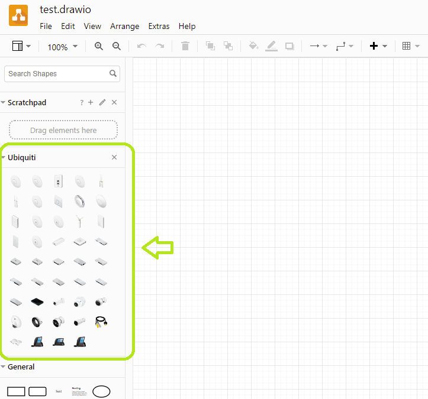

# ubiquiti-drawio

[Draw.io](https://draw.io) library for Ubiquiti networks

The SVG shapes were retrieved from the [official](https://help.ui.com/hc/en-us/articles/204911374-Ubiquiti-Icons-and-Images-for-Diagrams) Ubiquiti site

In particular, the file used was _UniFi-2017 SVG.zip_ (available SVG file at the time of writing)

## Usage

1. In draw.io, create a new diagram.

2. Then go to `File -> Open Library From -> Url...`
3. Enter `https://github.com/donhector/ubiquiti-drawio/raw/main/Ubiquiti.xml` as the URL
4. Click `Open`

NOTE: Depending on your connection, this might take a while (the library is around 40Mb) so be patient.

You should see the new library loaded in draw.io:

## Building your own library

Creating a new library in draw.io is also straight forward. That's how I created the Ubiquiti one.

1. Open draw.io
2. Go to `File -> New Library -> Device...`
3. Give your library a name. ie: `MyLib.xml`
4. Click `Add images`
5. Drag and drop desired images into the dialog (those can be .svg files no problem).
6. Keep adding images until you are done
7. Click `Save`

That will import the `MyLib` library into the `draw.io` UI and will also download it as an xml file to your computer (ie: `MyLib.xml`)
